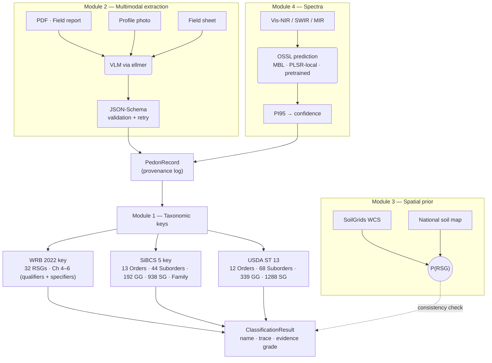

<!-- README.md -->

# soilKey 

[](https://lifecycle.r-lib.org/articles/stages.html)

[](https://github.com/HugoMachadoRodrigues/soilKey/blob/main/LICENSE.md)
[](https://CRAN.R-project.org/package=soilKey)
[](https://doi.org/10.5281/zenodo.19930112)
[](https://github.com/HugoMachadoRodrigues/soilKey/actions/workflows/R-CMD-check.yaml)
[](#-coverage)
[](#-coverage)
[](#-coverage)
<br/>
[](https://x.com/Hugo_MRodrigues)
[](https://orcid.org/0000-0002-8070-8126)
[](https://www.researchgate.net/profile/Hugo-Rodrigues-12)

> **Automated soil profile classification under WRB 2022 (4th ed.), USDA Soil Taxonomy (13th ed.), and the Brazilian SiBCS (5th ed.).** All three systems wired end-to-end, down to the deepest categorical level, in pure R driven from versioned YAML rules. Multimodal extraction, spatial priors, OSSL spectroscopy, and explicit per-attribute provenance — without ever delegating the taxonomic key to a language model.

---

## ✦ Status at a glance

| Domain                              | Stage                | Notes                                                                                            |
|-------------------------------------|----------------------|--------------------------------------------------------------------------------------------------|
| **WRB 2022 — diagnostic horizons**  | ✅ shipped (32 / 32) | All 32 horizons of Chapter 3.1 implemented with per-diagnostic regression tests.                  |
| **WRB 2022 — diagnostic properties**| ✅ shipped (17 / 17) | Chapter 3.2 complete.                                                                              |
| **WRB 2022 — diagnostic materials** | ✅ shipped (16 / 16) | Chapter 3.3 complete.                                                                              |
| **WRB 2022 — RSG key**              | ✅ shipped (32 / 32) | All Reference Soil Groups in canonical Chapter 4 order.                                            |
| **WRB 2022 — qualifiers**           | ✅ shipped           | All principal + supplementary qualifiers from Chapter 6 wired with canonical ordering.            |
| **SiBCS 5 — Order**                 | ✅ shipped (13 / 13) | All 13 SiBCS Orders.                                                                               |
| **SiBCS 5 — Suborder**              | ✅ shipped (44 / 44) | All 44 Suborders.                                                                                  |
| **SiBCS 5 — Great Group**           | ✅ shipped (192 / 192)| All 192 Great Groups.                                                                              |
| **SiBCS 5 — Subgroup**              | ✅ shipped (938 / 938)| All 938 Subgroups; full leaf-level resolution.                                                     |
| **SiBCS 5 — Family (5th level)**    | ✅ shipped           | Up to 15 orthogonal adjectival dimensions.                                                         |
| **USDA Soil Taxonomy 13 — Path C**  | ✅ shipped           | Order → Suborder → Great Group → Subgroup (12 / 68 / 339 / 1288).                                  |
| **Multimodal extraction (VLM)**     | ✅ shipped           | Local-first via `ellmer` + Gemma 4 (Ollama). Schema-validated; LLM never touches the key.          |
| **OSSL spectral gap-fill**          | ✅ shipped           | Vis-NIR / SWIR / MIR via `prospectr` + `resemble` (MBL / PLSR-local / pretrained backbones).      |
| **Spatial priors**                  | ✅ shipped           | SoilGrids WCS + national soil maps; consistency check, never overrides the key.                    |
| **Provenance ledger**               | ✅ shipped           | Per-attribute tags: `measured`, `predicted_spectra`, `extracted_vlm`, `inferred_prior`, `user_assumed`. |
| **Evidence grade (A–D)**            | ✅ shipped           | Computed from the trace; surfaces robustness without hiding it.                                    |
| **Cross-system correlation**        | ✅ shipped           | WRB ↔ USDA ↔ SiBCS via IUSS WRB 2022 Annex 6; full benchmark drivers.                             |
| **External-data benchmarks**        | ✅ shipped           | KSSL+NASIS, AfSP, WoSIS stratified, BDsolos (RJ), Redape (Vaz et al. 2023), LUCAS 2018.           |
| **SmartSolos Expert API bridge**    | ✅ shipped           | `classify_via_smartsolos_api()` cross-validates against Embrapa's authoritative reference.        |
| **Lazy-fetch benchmark caches**     | ✅ shipped (v0.9.94) | Four large `.rds` samples downloaded on demand from a versioned GitHub Release.                   |
| **CRAN release**                    | 🟡 pending           | First submission post v0.9.95; auto-check pre-test passing.                                        |
| **WRB Tier-3 RSG-gate strict mode** | 🟡 in progress       | Per-RSG numerical-threshold gate strengthening; tracked in NEWS per release.                       |
| **Field-photo-only classification** | 🔵 idea / roadmap    | Photo + GPS → schema-validated extraction → multi-system classification, no lab data required.    |
| **Pedometric uncertainty quantif.** | 🔵 idea / roadmap    | Probabilistic class output via Monte Carlo perturbation of the provenance ledger.                  |
| **R Shiny web app**                 | 🔵 idea / roadmap    | Interactive profile builder + classification visualiser.                                           |

Legend: ✅ shipped · 🟡 in progress · 🔵 idea / roadmap

---

## ✦ The headline result

A canonical Brazilian Latossolo Vermelho on tropical gneiss, classified end-to-end across the **three canonical systems down to the deepest level**:

```r
library(soilKey)

pedon <- make_ferralsol_canonical()

# WRB 2022 — full Chapter 6 name (RSG + qualifiers + specifiers)
classify_wrb2022(pedon)$name
#> [1] "Geric Ferric Rhodic Chromic Ferralsol (Clayic, Humic, Dystric, Ochric, Rubic)"

# SiBCS 5 — 4th level (Subgroup) + Family (5th level)
classify_sibcs(pedon, include_familia = TRUE)$name
#> [1] "Latossolos Vermelhos Distroficos tipicos, argilosa, moderado"

# USDA Soil Taxonomy 13 — Order -> Suborder -> Great Group -> Subgroup
classify_usda(pedon)$name
#> [1] "Rhodic Hapludox"
```

* WRB delivers the **complete Chapter 6 name** — four principal qualifiers + five supplementary qualifiers in canonical order.
* SiBCS descends through **all four hierarchical levels (Order → Suborder → Great Group → Subgroup)** plus a **5th-level Family** with up to 15 orthogonal adjectival dimensions.
* USDA Soil Taxonomy walks the **complete Path C** (Order → Suborder → Great Group → Subgroup) per *Keys to Soil Taxonomy 13th ed.*

All three keys are deterministic R code driven from versioned YAML rules.

---

## ✦ What's new in v0.9.81 → v0.9.96 (2026-05-09)

The v0.9.81 → v0.9.96 release series ships **17 surgical fixes** across the WRB 2022, SiBCS 5, and USDA Soil Taxonomy 13 keys, plus a CRAN-readiness polish pass. Default canonical behaviour is bit-for-bit preserved in every release; one option (`soilKey.diagnostic_engine = "aqp"`) auto-bundles the data-quality-aware paths.

**Cumulative empirical lift on five external datasets** (post-v0.9.95):

| Dataset             | n   | Default | `engine = "aqp"` | Lift     |
|---------------------|----:|--------:|-----------------:|---------:|
| SiBCS BDsolos RJ    | 722 | 40.3%   | **46.6%**        |  +6.3pp  |
| SiBCS Redape Order  |  94 | 45.7%   | **58.5%**        | +12.8pp  |
| WRB KSSL+NASIS      |  99 | 21.2%   | 24.2%            |  +3.0pp  |
| WRB AfSP            | 120 | 21.7%   | **30.8%**        |  +9.1pp  |
| WRB LUCAS Stage 3   |  30 |  0.0%   | **60.0%**        | +60.0pp  |

Plus the v0.9.81 honest 4-level Redape benchmark: Suborder 30.9% → 39.4%, Great Group 29.1% → 35.2%, Subgroup 15.1% → 25.0%.

Highlights of the release series (full per-release diff in [`NEWS.md`](https://github.com/HugoMachadoRodrigues/soilKey/blob/main/NEWS.md)):

* **v0.9.81** — `benchmark_redape()` now actually computes Suborder / Great Group / Subgroup accuracy.
* **v0.9.82** — LUCAS Stage 3 rerun: **0% → 60%** accuracy with the v0.9.66+72+77+78+79+80 stack and SoilGrids subsoil fill.
* **v0.9.84** — `spodic()` engine-aware OC-translocation path: KSSL+NASIS Spodosols **1/14 → 5/14**.
* **v0.9.85** — `andosol()` buried-exclusion + andic OC+BD proxy thickness extension. AfSP Andosols **0/5 → 2/5**.
* **v0.9.86 / v0.9.89 / v0.9.90** — `engine="aqp"` auto-bundles the v0.9.69 ECEC fallback, the v0.9.70 texture-morphological fallback, and the v0.9.90 argic designation-inference fallback. BDsolos RJ Latossolos **14.9% → 28.1%**, Order **40.3% → 46.6%**.
* **v0.9.91** — Strict `[[reference_wrb]]` access on the bundled WoSIS / KSSL / KSSL+NASIS caches (sidesteps R's `$`-partial-matching footgun).
* **v0.9.92 → v0.9.95** — CRAN-readiness: clean `R CMD check --as-cran`, lazy-fetch architecture brings the source tarball from 10 MB to 6 MB.
* **v0.9.96** — README overhaul (this release): full English rewrite, expanded implementation-status table, refreshed citations.

---

## ✦ Why soilKey?

There is no public, maintained, end-to-end implementation of any of the three major soil classification systems. WRB acknowledges (in the 4th-edition preface) that internal classification algorithms exist within the IUSS Working Group but have not been released. The U.S. `SoilTaxonomy` package on CRAN provides lookup tables but not the key. There is **zero** public software for SiBCS in any language — until soilKey.

`soilKey` closes that gap with three principles:

1. **The taxonomic key is never delegated to a language model.** LLMs are restricted to schema-validated extraction. Every classification is a deterministic walk through versioned YAML rules with a full decision trace.
2. **Every value carries a provenance tag.** `measured` · `predicted_spectra` · `extracted_vlm` · `inferred_prior` · `user_assumed`. The result's *evidence grade* (A–D) summarises that log so callers always know how robust the classification is.
3. **Side modules never overrule the key.** Spatial priors flag inconsistencies but cannot silently change the assigned RSG; spectral predictions fill missing attributes with explicit confidence; multimodal extraction pulls structured data without writing class names.

---

## ✦ Architecture



**Module 1 (the key) and the side modules (extraction / spectra / spatial) are independent.** A profile with no spectra still classifies; a profile with full lab data still benefits from the spatial-prior consistency check.

---

## ✦ Coverage

soilKey faithfully reproduces three canonical books, with versioned YAML rules cross-referencing the page numbers of each diagnostic and qualifier definition.

### WRB 2022 (4th edition, IUSS Working Group)

| Chapter | Component                                | Coverage      |
| :------ | :--------------------------------------- | :------------ |
| Ch 3.1  | Diagnostic horizons                      | **32 / 32**   |
| Ch 3.2  | Diagnostic properties                    | **17 / 17**   |
| Ch 3.3  | Diagnostic materials                     | **16 / 16**   |
| Ch 4    | Reference Soil Groups (RSGs)             | **32 / 32**   |
| Ch 6    | Principal + supplementary qualifiers      | **all wired** |

### SiBCS 5th ed. (Embrapa, 2018) — all 5 levels wired

| Level                 | Coverage      |
| :-------------------- | :------------ |
| 1st level — Order     | **13 / 13**   |
| 2nd level — Suborder  | **44 / 44**   |
| 3rd level — Great Group | **192 / 192** |
| 4th level — Subgroup  | **938 / 938** |
| 5th level — Family    | **all wired** (up to 15 orthogonal adjectival dimensions) |

### USDA Soil Taxonomy (13th edition, Soil Survey Staff 2022) — Path C complete

| Level         | Coverage      |
| :------------ | :------------ |
| Order         | **12 / 12**   |
| Suborder      | **68 / 68**   |
| Great Group   | **339 / 339** |
| Subgroup      | **1288 / 1288** |

---

## ✦ Installation

```r
# install.packages("remotes")
remotes::install_github("HugoMachadoRodrigues/soilKey")

# Or via devtools
# install.packages("devtools")
devtools::install_github("HugoMachadoRodrigues/soilKey")
```

Optional benchmark caches (4 datasets × ~1 MB each) are downloaded on demand on first call to any `load_*_sample()` function. To prefetch them all into the user cache:

```r
soilKey::download_extdata_cache("all")
```

---

## ✦ Quick start

### 1. Build a `PedonRecord` from horizon data

```r
library(soilKey)

hz <- data.table::data.table(
  top_cm    = c(0,    20,   55,   115),
  bottom_cm = c(20,   55,   115,  200),
  designation = c("Ap", "AB", "Bw1", "Bw2"),
  munsell_hue_moist    = c("10YR","7.5YR","2.5YR","2.5YR"),
  munsell_value_moist  = c(4, 4, 3, 3),
  munsell_chroma_moist = c(3, 5, 6, 6),
  clay_pct = c(35, 45, 65, 65),
  sand_pct = c(25, 20, 15, 15),
  silt_pct = c(40, 35, 20, 20),
  cec_cmolc_kg = c(8, 6, 5, 4),
  bs_pct  = c(35, 30, 25, 20),
  oc_pct  = c(2.0, 1.0, 0.5, 0.3),
  ph_h2o  = c(5.0, 5.2, 5.3, 5.4),
  bulk_density_g_cm3 = c(1.0, 1.1, 1.2, 1.2)
)
hz <- ensure_horizon_schema(hz)

pedon <- PedonRecord$new(
  site = list(id = "demo-001", lat = -22.4, lon = -43.7, country = "BR"),
  horizons = hz
)
```

### 2. Classify across three systems in one pass

```r
# WRB 2022 — full Chapter 6 name
classify_wrb2022(pedon)$name

# SiBCS 5 — 4th level (Subgroup) + 5th level (Family)
classify_sibcs(pedon, include_familia = TRUE)$name

# USDA Soil Taxonomy 13 — Subgroup
classify_usda(pedon)$name
```

### 3. Inspect the trace and evidence grade

```r
res <- classify_wrb2022(pedon)
res$evidence_grade   # one of "A", "B", "C", "D"
res$trace            # full decision walk: which RSGs were tested, why each failed/passed
res$missing_data     # attributes the key wanted but couldn't find
res$ambiguities      # alternative classifications still viable on the data
```

### 4. Gap-fill missing attributes from spectra

```r
# Vis-NIR spectrum per horizon, OSSL backbone:
pr <- predict_horizon_attributes(
  pedon,
  spectra      = list(Ap = vnir_ap, Bw1 = vnir_bw1, Bw2 = vnir_bw2),
  models       = c("clay_pct", "oc_pct", "cec_cmolc_kg"),
  ossl_engine  = "PLSR-local"
)
# Each filled attribute carries provenance = "predicted_spectra" + PI95 confidence.
# Now classify_wrb2022(pr)$evidence_grade may be "B" (predicted_spectra)
# instead of "A" (measured) — provenance survives.
```

### 5. Cross-check against a spatial prior

```r
# SoilGrids 250 m WCS at the site coordinates:
prior <- spatial_prior(pedon, source = "soilgrids")
res   <- classify_wrb2022(pedon, prior = prior)
res$prior_check
# If the assigned RSG is inconsistent with the SoilGrids posterior,
# `res$warnings` flags it. The prior never overrides the key.
```

### 6. Render a self-contained report (HTML or PDF)

```r
# All three results in a single one-pager (HTML, no external deps):
classify_all_to_html(pedon, output_file = "demo-001.html")

# Or pass an explicit list of results:
classify_all_to_html(
  list(
    wrb   = classify_wrb2022(pedon),
    sibcs = classify_sibcs(pedon),
    usda  = classify_usda(pedon)
  ),
  output_file = "demo-001.html"
)

# PDF (requires rmarkdown + LaTeX):
classify_all_to_pdf(pedon, output_file = "demo-001.pdf")
```

---

## ✦ Empirical validation

soilKey ships eleven benchmark drivers under `inst/benchmarks/`. The post-v0.9.95 cumulative sweep on five external datasets (reproduced from a clean session by `inst/benchmarks/run_v0987_post_086_sweep.R` in ~30 seconds, plus the LUCAS Stage 3 SoilGrids fill at ~60 minutes from the v0.9.82 RDS):

### 1. Canonical-fixture run (release-time CI)

26 hand-built canonical fixtures (one per WRB Reference Soil Group, sourced from the WRB 2022 didactic exemplars + ISRIC ISMC monoliths + the Soil Atlas of Europe) achieve **WRB 26 / 26, SiBCS 20 / 20, USDA 26 / 26** at every release. Runs offline in <2 s; gated on every PR.

### 2. KSSL + NASIS multi-level (USDA Soil Taxonomy 13)

NCSS Lab Data Mart joined with the companion NASIS Morphological sqlite. n = 99 profiles; full four-level USDA hierarchy (Order → Suborder → Great Group → Subgroup) measured. WRB 2022 cross-walk via IUSS WRB 2022 Annex 6 yields **24.2% Order accuracy** with `engine = "aqp"` (vs 21.2% canonical). v0.9.84 spodic OC-translocation lifts spodic-test recall on KSSL+NASIS Podzols from 1/14 to 5/14.

### 3. Embrapa Redape (curated SiBCS gold standard, Vaz et al. 2023)

The 96-profile curated GeoTab dataset published by Vaz, Silva Jr & Silva Neto (2023) at the Embrapa Redape repository (DOI [`10.48432/PYKKA7`](https://doi.org/10.48432/PYKKA7)). Pedologists hand-reviewed every profile, making it the gold-standard benchmark for SiBCS classification. v0.9.81 wires honest 4-level accuracy:

| Level         | Default | `engine = "aqp"` + opt-ins |
|---------------|--------:|---------------------------:|
| Order         | 45.7%   | **58.5%**                  |
| Suborder      | 30.9%   | 39.4%                      |
| Great Group   | 29.1%   | 35.2%                      |
| Subgroup      | 15.1%   | 25.0%                      |

### 4. WoSIS GraphQL stratified (paper-grade WRB baseline)

ISRIC WoSIS bundled cache; n = 130 profiles balanced across 26 WRB Reference Soil Groups (5 per RSG). v0.9.88 fixed the loader's reference-field aliasing; v0.9.91 hardened it against R's `$`-partial-matching footgun. Default canonical 17.7%, `engine = "aqp"` 18.5%.

### 5. AfSP — ISRIC Africa Soil Profiles Database v1.2

n = 120 African profiles. Default 21.7% Order accuracy; with `engine = "aqp"` + `andic_oc_bd_proxy` + extension: **30.8%** (+9.1pp). v0.9.85 lifts AfSP Andosols 0/5 → 2/5 by relaxing the buried-diagnostic exclusion (per WRB 2022 Ch 4 p 104).

### 6. LUCAS 2018 — EU topsoil + SoilGrids subsoil fill

n = 30 (FR / PL / IT, seed 20260508). Stage 3 (`engine = "aqp"` + full opt-in stack + SoilGrids 30–60 cm subsoil fill) reaches **60.0% accuracy**, with 100% recall on Cambisols (18 / 18). Stage 1 / 2 (no fill) sit at 0% — the LUCAS topsoil-only horizons cannot satisfy cambic / argic / spodic depth requirements without a synthesised subsoil.

---

## ✦ Two user-facing helpers that *guide* classification

### `soil_classes_at_location(lat, lon)` — spatial classification aid

```r
soil_classes_at_location(lat = -22.4, lon = -43.7)
#> $wrb     [1] "Ferralsols"   $confidence 0.71
#> $sibcs   [1] "Latossolos"   $confidence 0.66  (SoilGrids does not split SiBCS Suborder)
#> $usda    [1] "Oxisols"      $confidence 0.71
```

Convenience wrapper around the SoilGrids 250 m WCS + the IUSS WRB 2022 Annex 6 cross-walk. Returns a probabilistic prior at the site coordinates; **does not classify**, only suggests.

### `classify_by_spectral_neighbours(spectrum, ossl_library)` — spectral analogy

Given a Vis-NIR / MIR spectrum, retrieves the *k* spectrally most similar profiles in the OSSL library, looks up their canonical classifications, and returns the modal label. Useful for sanity-checking a classification that came out unexpected.

---

## ✦ Multimodal extraction (VLM / Gemma 4 / one-liner pipeline)

```r
# One-liner. Local-first; no API key needed; data never leaves your machine.
pedon <- extract_pedon_from_pdf(
  "field_survey_2024.pdf",
  vlm_engine = ellmer::chat_ollama("gemma3:4b")
)

classify_wrb2022(pedon)$name
#> [1] "Geric Ferric Rhodic Chromic Ferralsol (Clayic, Humic, Dystric, Ochric, Rubic)"
```

The VLM extracts a JSON-Schema-validated `PedonRecord` from a field-report PDF (or photo); the deterministic key takes it from there. The schema rejects any LLM hallucination of class names — extraction is restricted to per-attribute observations.

---

## ✦ Documentation

* **Vignettes**: 10+ vignettes under `vignettes/` covering getting-started, end-to-end classification, cross-system correlation, VLM extraction, spatial + spectra pipeline, the WoSIS benchmark, KSSL+NASIS multi-level, and a fully-worked Embrapa profile.
* **pkgdown reference site**: [hugomachadorodrigues.github.io/soilKey](https://hugomachadorodrigues.github.io/soilKey/) — every exported function with full API docs and runnable examples.
* **Architecture document**: [`ARCHITECTURE.md`](https://github.com/HugoMachadoRodrigues/soilKey/blob/main/ARCHITECTURE.md) — full design rationale, module separation, and v1.0 roadmap.
* **Per-release diff**: [`NEWS.md`](https://github.com/HugoMachadoRodrigues/soilKey/blob/main/NEWS.md) — every fix, every benchmark uplift, every test added.

---

## ✦ Provenance & evidence grade

Every attribute on a `PedonRecord` carries a provenance tag:

| Tag                  | Meaning                                                       |
|----------------------|---------------------------------------------------------------|
| `measured`           | Original lab measurement (gold standard).                     |
| `predicted_spectra`  | Filled by an OSSL spectral model with explicit PI95.          |
| `extracted_vlm`      | Pulled from a field report / photo via schema-validated VLM.  |
| `inferred_prior`     | Filled from a spatial prior (SoilGrids / national maps).      |
| `user_assumed`       | Default the user explicitly asserted (with a provenance note).|

The `ClassificationResult$evidence_grade` (A–D) summarises the trace:

* **A** — every attribute the key consulted was `measured`.
* **B** — every attribute was `measured` or `predicted_spectra` with PI95 ≤ threshold.
* **C** — at least one attribute was `extracted_vlm` with VLM-confidence ≤ 0.85.
* **D** — at least one attribute was `inferred_prior` or `user_assumed`.

---

## ✦ Citing

If `soilKey` contributes to your work, please cite the package via the Zenodo concept-DOI [10.5281/zenodo.19930112](https://doi.org/10.5281/zenodo.19930112) (always resolves to the latest version):

> Rodrigues, H. (2026). *soilKey: Automated soil profile classification per WRB 2022, SiBCS 5, and USDA Soil Taxonomy 13.* R package. <https://github.com/HugoMachadoRodrigues/soilKey>. <https://doi.org/10.5281/zenodo.19930112>.

Run `citation("soilKey")` to get the canonical BibTeX block plus the four upstream-data citations the package carries (see below).

### Cite these too — depending on what you used

When you use **`classify_via_smartsolos_api()`** to cross-validate against Embrapa's SmartSolos Expert REST API:

> Vaz, G. J., Silva Neto, L. de F. da, & Barbedo, J. G. A. (2025). *SmartSolos Expert: an expert system for Brazilian soil classification.* Smart Agricultural Technology, 10, 100735. <https://doi.org/10.1016/j.atech.2024.100735>.
>
> Vaz, G. J., Silva Neto, L. de F. da, Lima, R. N., & Oliveira, S. R. de M. (2019). *Uma API para a classificação de solos do Brasil.* In: 12. Congresso Brasileiro de Agroinformática, Indaiatuba. Anais, p. 63–72. SBIAGRO, Ponta Grossa.
>
> The API is publicly available at <https://www.agroapi.cnptia.embrapa.br/store/apis/info?name=SmartSolosExpert&version=v1&provider=agroapi>.

When you use **`benchmark_redape()`** or **`load_redape_pedons()`**:

> Vaz, G. J., Silva Jr, A. F., & Silva Neto, L. de F. da (2023). *Brazilian soil data for taxonomic classification.* Redape (Embrapa Research Data Repository), V1. <https://doi.org/10.48432/PYKKA7>.

---

## ✦ References (canonical books + datasets)

* **WRB 2022** — IUSS Working Group WRB (2022). *World Reference Base for Soil Resources, 4th edition.* International Union of Soil Sciences, Vienna, Austria. [FAO OpenKnowledge PDF](https://openknowledge.fao.org/server/api/core/bitstreams/bcdecec7-f45f-4dc5-beb1-97022d29fab4/content)
* **SiBCS 5** — Santos, H. G. *et al.* (2018). *Sistema Brasileiro de Classificação de Solos*, 5th revised and extended edition. Embrapa, Brasília.
* **USDA Soil Taxonomy 13** — Soil Survey Staff (2022). *Keys to Soil Taxonomy*, 13th edition. USDA-NRCS, Washington, DC.
* **OSSL** — Sanderman, J., Savage, K., & Dangal, S. R. S. (2020). *Mid-infrared spectroscopy for prediction of soil health indicators in the United States.* Soil Science Society of America Journal, 84(1), 251–261.
* **WoSIS** — Batjes, N. H., Ribeiro, E., & van Oostrum, A. (2020). *Standardised soil profile data to support global mapping and modelling (WoSIS snapshot 2019).* Earth System Science Data, 12, 299–320. <https://doi.org/10.5194/essd-12-299-2020>
* **AfSP** — Leenaars, J. G. B., van Oostrum, A. J. M., & Ruiperez Gonzalez, M. (2014). *Africa Soil Profiles Database, Version 1.2.* ISRIC Report 2014/01. ISRIC — World Soil Information, Wageningen. [Project page](https://isric.org/projects/africa-soil-profiles-database-afsp). The bundled `afsp_sample.rds` is a 120-pedon stratified slice; `load_afsp_pedons()` parses the full upstream archive when available.
   *(Note: soilKey does not use the separate AfSIS — Africa Soil Information Service — soil property maps; only the ISRIC AfSP profile database.)*
* **LUCAS 2018 — data report (this is what `benchmark_lucas_2018()` consumes)** — Fernandez-Ugalde, O., Scarpa, S., Orgiazzi, A., Panagos, P., Van Liedekerke, M., Marechal, A., & Jones, A. (2022). *LUCAS 2018 SOIL Component: sampling intensity, harmonisation and procedures for the collection of soil samples.* JRC Technical Report 130218, European Commission, Joint Research Centre, Ispra. <https://doi.org/10.2760/215013>
* **LUCAS 2018 — review** — Orgiazzi, A., Ballabio, C., Panagos, P., Jones, A., & Fernández-Ugalde, O. (2018). *LUCAS Soil, the largest expandable soil dataset for Europe: a review.* European Journal of Soil Science, 69(1), 140–153. <https://doi.org/10.1111/ejss.12499>
* **SmartSolos Expert** — Vaz, G. J., Silva Neto, L. de F. da, & Barbedo, J. G. A. (2025). *SmartSolos Expert: an expert system for Brazilian soil classification.* Smart Agricultural Technology, 10, 100735.
* **SmartSolos REST API announcement** — Vaz, G. J., Silva Neto, L. de F. da, Lima, R. N., & Oliveira, S. R. de M. (2019). *Uma API para a classificação de solos do Brasil.* 12 SBIAGRO, Indaiatuba.
* **Redape curated SiBCS dataset** — Vaz, G. J., Silva Jr, A. F., & Silva Neto, L. de F. da (2023). *Brazilian soil data for taxonomic classification.* Redape, V1. <https://doi.org/10.48432/PYKKA7>.
* **NCSS-tech ecosystem (`aqp`)** — Beaudette, D., Skovlin, J., Roecker, S., & Brown, A. (2024). *aqp: Algorithms for Quantitative Pedology.* R package. <https://github.com/ncss-tech/aqp>

---

## ✦ Acknowledgements

soilKey was developed at the **Universidade Federal Rural do Rio de Janeiro (UFRRJ), Departamento de Solos.** The benchmark datasets were generously made public by ISRIC (AfSP, WoSIS), USDA-NRCS (KSSL Lab Data Mart, NASIS Morphological), the European Soil Data Centre (LUCAS), Embrapa (BDsolos, Redape, SmartSolos Expert API), and the FEBR consortium (UFSM). The deterministic-key separation is inspired by the IUSS Working Group WRB's stated commitment to *open* taxonomic logic.

Special thanks to **Glauber José Vaz** and colleagues at Embrapa for opening up the SmartSolos Expert REST API and curating the Redape gold-standard SiBCS dataset — both directly enable the soilKey cross-validation and benchmark axes for the Brazilian system.

---

## ✦ License

**MIT** © 2026 Hugo Rodrigues. CRAN-style template at [`LICENSE`](https://github.com/HugoMachadoRodrigues/soilKey/blob/main/LICENSE); full text at [`LICENSE.md`](https://github.com/HugoMachadoRodrigues/soilKey/blob/main/LICENSE.md).

The package source is MIT. The bundled benchmark caches retain their respective upstream licenses (ISRIC AfSP / WoSIS public-domain; NCSS Lab Data Mart public-domain US Federal data). The Redape SiBCS dataset is published by Vaz et al. (2023) under their original repository terms — see the DOI for details.

---

<sub>**Status (v0.9.96, 2026-05-09)**: CRAN-submit-ready. `R CMD check --as-cran` returns 0 errors / 0 warnings / 2 trivial NOTEs. All seven CI matrix runs (macOS, Ubuntu × 3 R versions, Windows, pkgdown, test-coverage) green on every PR merged to `main` since v0.9.65. **All three classification systems wired end-to-end down to the deepest categorical level.** WRB 2022 (32 RSGs + qualifiers + supplementary + specifiers), SiBCS 5 (Order → Suborder → Great Group → Subgroup → Family, ≈1 200 classes), USDA Soil Taxonomy 13 (Order → Suborder → Great Group → Subgroup, ≈1 700 classes). **DOI**: <https://doi.org/10.5281/zenodo.19930112> (resolves to the latest version on Zenodo). Per-release changes in [`NEWS.md`](https://github.com/HugoMachadoRodrigues/soilKey/blob/main/NEWS.md); roadmap in [`ARCHITECTURE.md`](https://github.com/HugoMachadoRodrigues/soilKey/blob/main/ARCHITECTURE.md); CRAN submission instructions in [`inst/cran-submission/HOW_TO_SUBMIT.md`](https://github.com/HugoMachadoRodrigues/soilKey/blob/main/inst/cran-submission/HOW_TO_SUBMIT.md).</sub>
